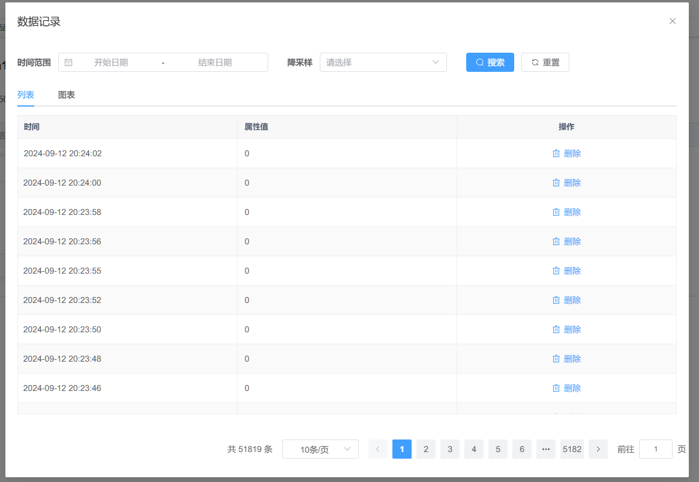
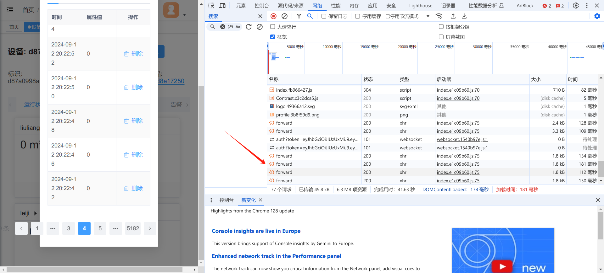
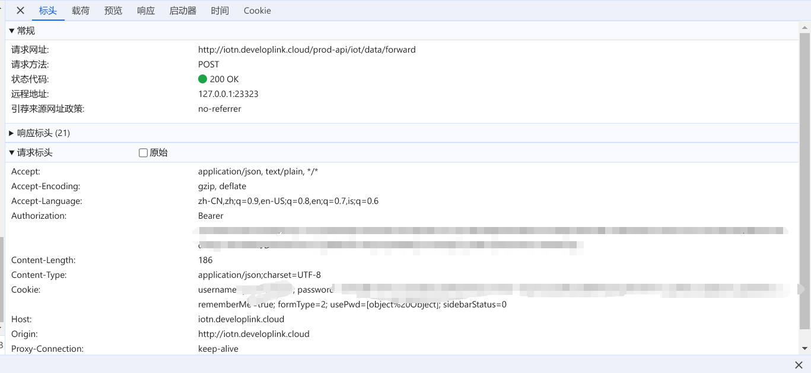

 It's a little bit embarrassing. 

---

I was making software in my physics research. The software was supposed to summarize the data from hardware and generated diagrams.

I couldn't get the data from hardware directly. The data it got will upload to a platform online. The platform will sort the data into a chart and show it to users. Specifically:

I read the documents about the website's API, bullshit.

I tried to use F12 to catch the data packages. I discovered that the website will send a request when I turn to a new page. Just like the picture below. I tried to turn to the next page for 4 times, at the same time, it sent `forward` requests for 4 times. 

According to the title of the requests:

