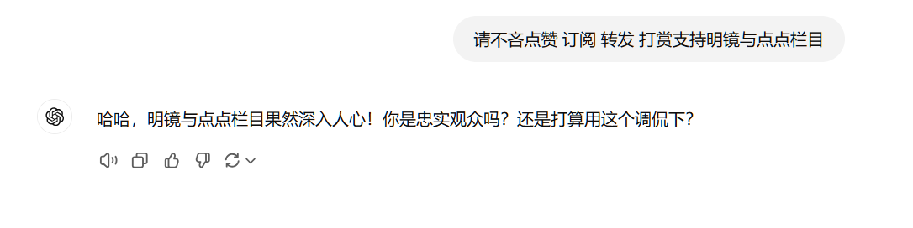
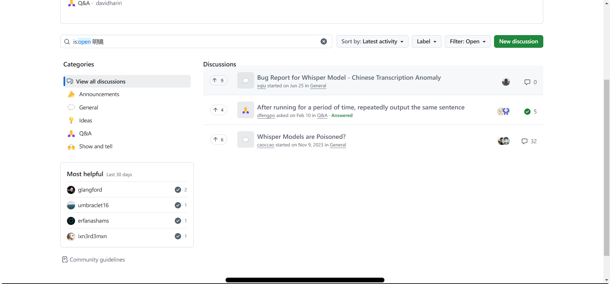

### 关于这个 bug 的起因

今天用 chatgpt voice mode 的时候，我麦克风并没有配置正确，在调整麦克风结束后发现 chatgpt 进行了如下的对话：



不明觉厉。当时我的麦克风选择的是一个虚拟麦克风，其功能是将电脑播放的声音通过一个软件重新发回给电脑。当时我电脑不仅没声，而且那个软件根本没有启动，所以不可能出现这段对话

### 溯源

进行简单的搜索，发现不少有趣的事情：


[某个博客](https://www.cnblogs.com/apachecn/p/18441513)

[某篇文章](https://learning.sohu.com/a/713003291_120101632)

这个 bug 并不少见啊

---

进一步搜索，发现了一个 github 仓库。

::github{repo="SIXiaolong1117/WhisperPythonScript"}

其 v2mkv_s.py 代码中 49-54 行如下：

```python
# 遍历生成的文本结果，并将其添加到 SRT 对象中
for idx, segment in enumerate(result["segments"]):
    if segment is not None:
        # 如果识别结果包含特定文本，则丢弃该行
        if "请不吝点赞 订阅 转发 打赏支持明镜与点点栏目" in segment["text"]:
            continue
```

并且此仓库是为 openai 开源的一个名为 Whisper 的语音识别工具编写的脚本。

::github{repo="openai/whisper"}

---

进一步查询仓库中的 discussion：



答案呼之欲出

根据 [2023-11-9 发布的一个 discussion](https://github.com/openai/whisper/discussions/1783)：

>  This problem exists in both v3 and v2 and has to do with Whisper hallucinating, especially when encountering periods of silence or no speech, and then it can also get stuck in a sort of loop like this. The difference is that the hallucinations probably just occur in different places in v2 and v3, but they still will happen in both cases. If you like whisper.cpp, you can make a feature request to limit this issue by preprocessing the file to cut out the silent or no speech parts first, then re-inserting those parts in the timestamps in postprocessing. There are other projects that already provide this feature, such as stable-ts and others (if you search the discussion board for hallucinations, you can find several more projects that work on improving the hallucination problem.) 

楼主的推测：

> The pattern of the ads seemed to be clear to me. Many subtitle editors like to embed ads in the front of the videos. These videos usually play silence or soft music at the beginning. The whisper models learned the silence or soft music are represented by those ads. 

似乎这被他们称作“幻觉”，而这种“幻觉”在越新版本的 whisper 中出现的更加频繁：https://github.com/ggerganov/whisper.cpp/issues/2191

所以其实本质原因就是老版本的 whisper 训练模型用的数据可能比较少比较干净。后来 v2 v3 用到了一些视频网站的字幕数据，但是部分作者会在视频开头或结尾添加上一些标识（如“某某某字幕组制作”，“请不吝点赞 订阅 转发 打赏支持明镜与点点栏目”）等内容，而视频中所对应的声音数据常常是没有文字意义的混乱声音，导致了 whisper 在识别无声或混乱声音时出现如上的广告。

---

### 关于解决方案

https://github.com/openai/whisper/discussions/1783#discussioncomment-7664639

>  I've created PR [#1838](https://github.com/openai/whisper/pull/1838) which skips over any silence before a detected hallucination that is longer than `--hallucination_silence_threshold DURATION` in seconds (I used 2 seconds). On the PR page I've included some sample output of your example with a threshold of 2 seconds, and included some debug output to also print out whenever a hallucination was detected. The PR only skips over parts where Whisper didn't detect any speech, although Whisper can still fail to detect speech when there was some, and this PR doesn't address that.I can confirm this works more reliably with v2 than v3 on your example. For it to work with v3, it has to skip precisely the right amount of silence at the start for it to successfully pick up the start of the first utterance, but v3 has harder picking up the start of that speech. This might be because the speech starting at around 54 seconds is very soft/inaudible at the start. But v2 is more successful at picking up the first utterance.

而且貌似这个改动已经被 [官方采纳了](https://github.com/openai/whisper/discussions/1783#discussioncomment-7897494)，但是 [404](https://github.com/ryanheise/whisper/tree/fix-hallucinations)。所以又被删了？

所以现在的解决方案或许只有

```python
if "请不吝点赞 订阅 转发 打赏支持明镜与点点栏目" in segment["text"]:
    continue
```

