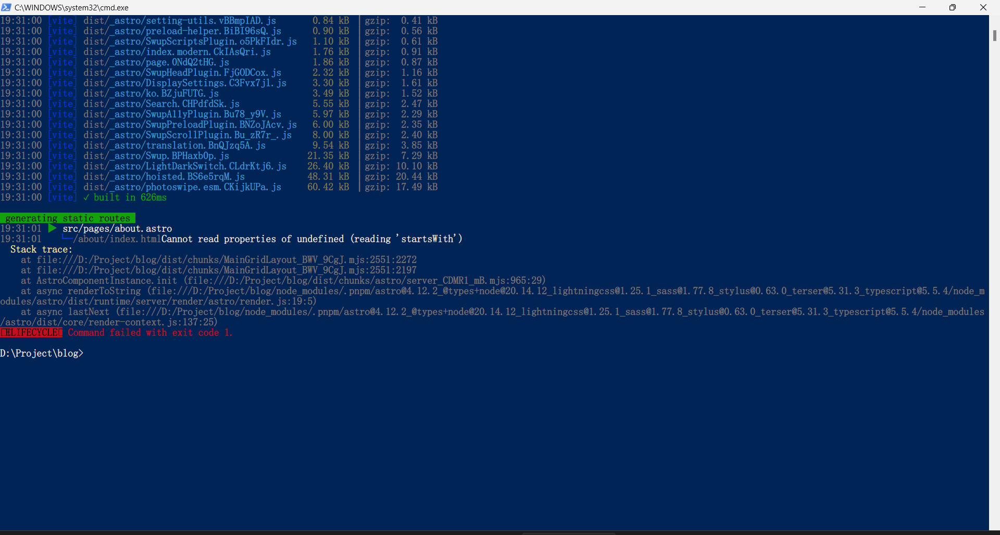
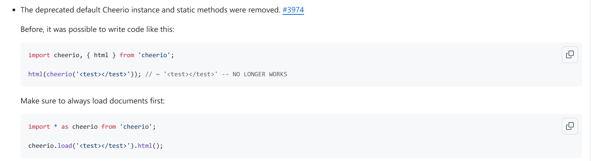
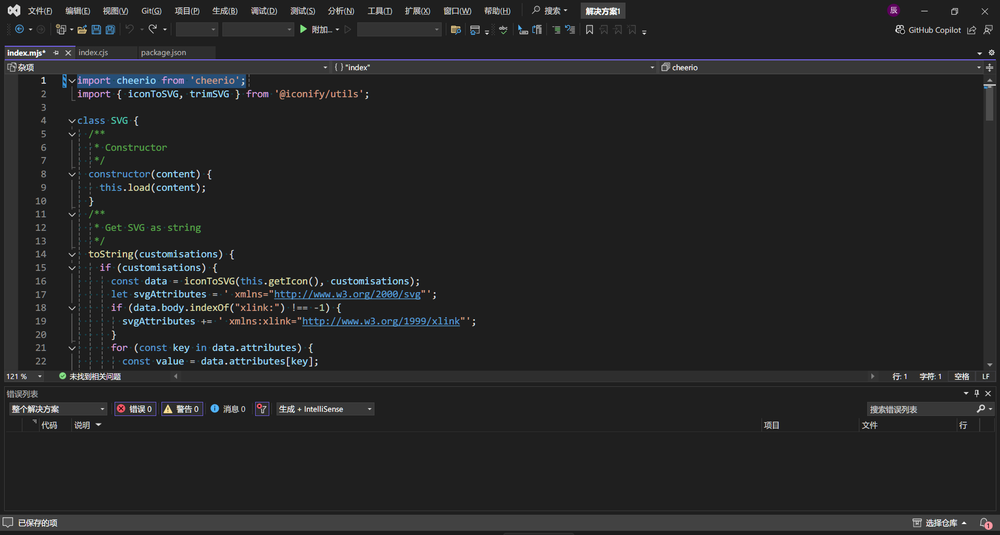
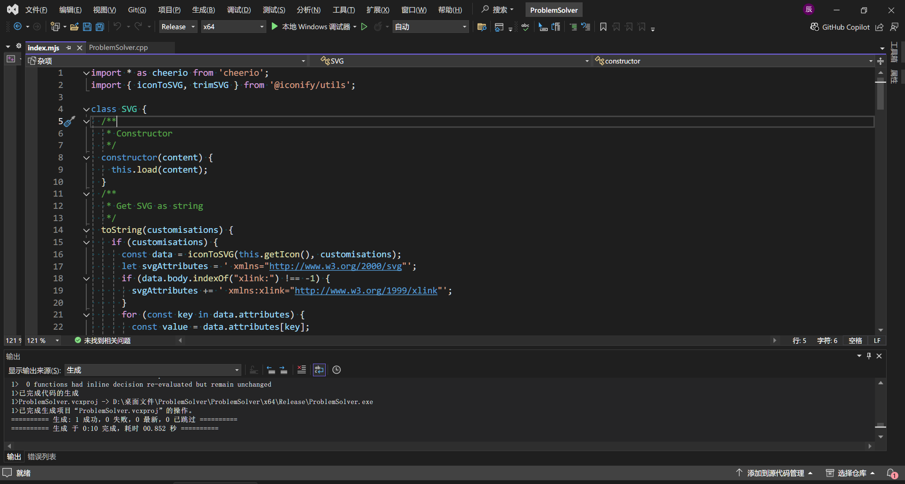
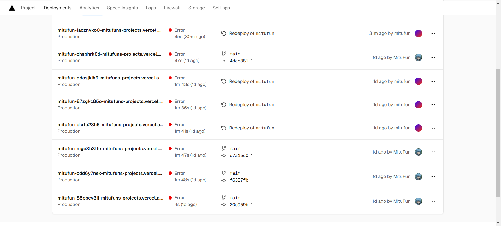
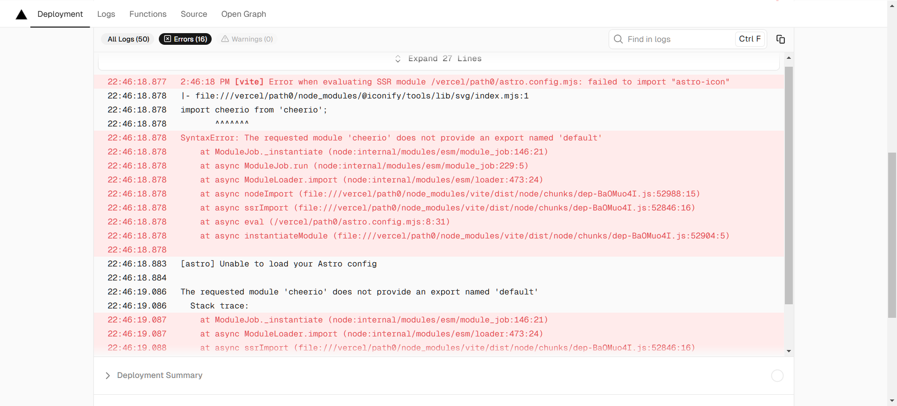

2024.9.6 想改一下博客的 icon，结果一改：



然后查不出来错，其实现在也不知道为啥跳这个错。

我就寻思也不能因为这个整个博客就寄掉了啊，就找 github 仓库里的历史版本，然后 clone 到本地。

结果好家伙，原来的版本跑一边 `pnpm run build` 结果也报错了：

```bash
The requested module 'cheerio' does not provide an export named 'default'
Stack trace:
at ModuleJob._instantiate (node:internal/modules/esm/module_job:134:21)
at async ModuleLoader.import (node:internal/modules/esm/loader:316:24)
at async ssrImport (file:///D:/Project/old-blog/node_modules/.pnpm/vite@5.4.3_@types+node@22.5.4_lightningcss@1.25.1_sass@1.78.0_stylus@0.63.0_terser@5.31.6/node_modules/vite/dist/node/chunks/dep-BaOMuo4I.js:52846:16)
at async instantiateModule (file:///D:/Project/old-blog/node_modules/.pnpm/vite@5.4.3_@types+node@22.5.4_lightningcss@1.25.1_sass@1.78.0_stylus@0.63.0_terser@5.31.6/node_modules/vite/dist/node/chunks/dep-BaOMuo4I.js:52904:5)
 ELIFECYCLE  Command failed with exit code 1.
```

贼迷惑啊，上上个月搭博客还啥事没有，就蹦了个：

```bash
ERR_PNPM_OUTDATED_LOCKFILE  Cannot install with "frozen-lockfile" because pnpm-lock.yaml is not up 
```

最后 [这篇博客](https://blog.csdn.net/thhhwr/article/details/136537959) 给出了解决方案，确实有效，删了 `pnpm-lock.yaml` 然后就搭好了，后续传文件也啥事没有。过了俩月就报错是吧。

直接给这段报错扔给 chatgpt，结果一堆车轱辘话，没啥卵用。

然后就死马当活马医扔到百度帮我搜一下，好家伙翻到一个 [stackflow](
https://stackoverflow.com/questions/78856096/error-when-evaluating-ssr-module-f-oceanh-workspace-project-blog-astro-astro-co)。好嘛，一模一样。而且：

> Modified 27 days ago

寻思有救了，解答老哥扔了个 [github 的 issue](https://github.com/natemoo-re/astro-icon/issues/231)，一模一样，都是因为 cheerio。下面一堆改 package.json 的，但是我实测并没有用，override pnpm 也没用，直到看到二楼老哥：

>  It has something to do with the latest release of Cheerio
> https://github.com/cheeriojs/cheerio/releases/tag/v1.0.0
> It was tagged 6 hours ago. This seems more like an issue with `@iconify/tools` 

打开一看



之后报错也给我提示了是在 `@iconify\tools\lib\svg\index.mjs` 报的错，然后打开一看，好家伙第一行：



典中典，把老的引用方式改成 `import * as cheerio from 'cheerio';`：



跑了遍 `pnpm run build` 没啥问题，然后本地网站看了也没啥问题，我就把他 push 到了我仓库，然后让 vercel 给我搭一下。然后好嘛：



不多评价了。

前几次主要报错是：



结果就是我本地改了，人家下的还是有 bug 的版本的。灵机一动，上传 `node_modules\@iconify\tools`。

然后就好了。然后就好了。然后就好了。然后就好了。然后就好了。然后就好了。然后就好了。然后就好了。然后就好了。然后就好了。然后就好了。然后就好了。然后就好了。然后就好了。然后就好了。然后就好了。然后就好了。然后就好了。然后就好了。然后就好了。然后就好了。然后就好了。然后就好了。然后就好了。然后就好了。然后就好了。然后就好了。然后就好了。然后就好了。然后就好了。然后就好了。然后就好了。然后就好了。然后就好了。然后就好了。然后就好了。然后就好了。然后就好了。然后就好了。然后就好了。然后就好了。然后就好了。然后就好了。然后就好了。然后就好了。然后就好了。然后就好了。然后就好了。然后就好了。然后就好了。然后就好了。然后就好了。然后就好了。然后就好了。然后就好了。然后就好了。然后就好了。


---


具体这个 bug 产生原因就是，`cheerio` 新版本引用方式要改，但是 `astro` 使用的 `@iconify\tools` 是老版本的还是采用老的应用方式导致无法正确引用 `cheerio` 库。（这个问题在新版的 `@iconify\tools` 已被解决，但是 `astro` 并没有跟进。。。）

而且 `cheerio` 更新时间是上个月，恰好卡在我首次搭建博客和改 icon 中间，一直就没出现这个错。。。。

找了两个晚上 bug 终于整好了。。。

