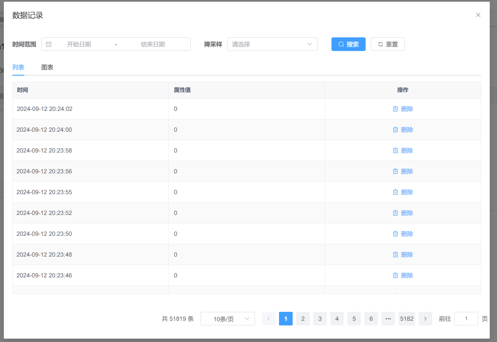
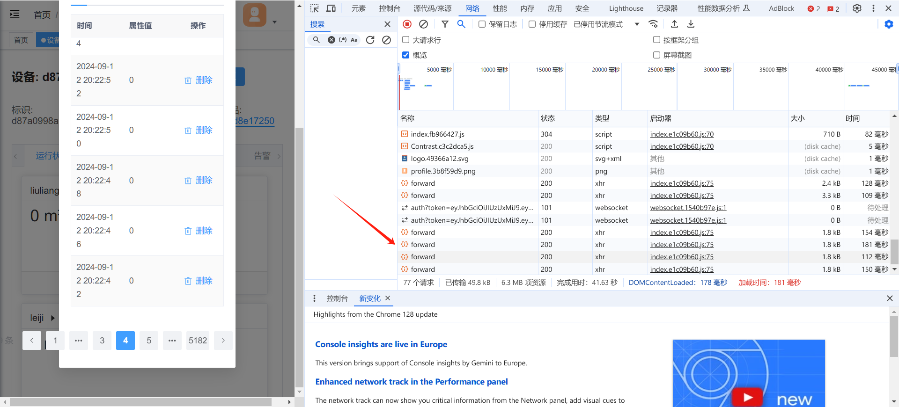
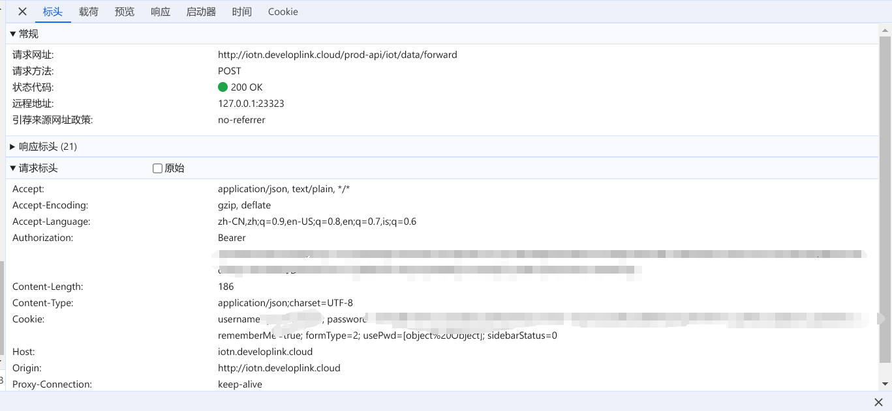
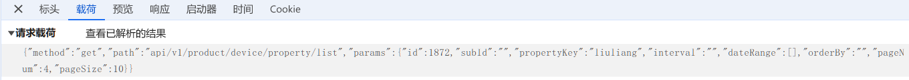

额，有点尴尬。

物理研学，我做软件。要求实现对硬件设备上传的数据进行收集，并生成图表。

硬件设备采集的数据我无法直接进行收集，它所采集的信息会上传至一物联网平台。物联网平台会将数据列为一个表格，呈现给用户。具体地：



我查阅网站 api 相关文档，简直屁用没有。

尝试使用 F12 对数据包进行采集，注意到每次翻页会发出一个请求，如下图，我进行了四次翻页操作，与此同时发出了四次 forward 请求：



根据请求中的标头：



以及请求载荷：



大致推测出此 api 的使用方法：

- Authorization 说明查询的设备信息，直接复制即可。
- Cookie 说明用户信息，直接复制即可。

载荷中：

` {"method":"get","path":"api/v1/product/device/property/list","params":{"id":1872,"subId":"","propertyKey":"liuliang","interval":"","dateRange":[],"orderBy":"","pageNum":4,"pageSize":10}} `

望文生义。

观察响应数据：

```json
{
    "msg": "操作成功",
    "code": 200,
    "data": {
        "List": [
            {
                "ts": "2024-09-12 20:23:02",
                "timestamp": "2024-09-12T20:23:02+08:00",
                "value": 0,
                "subId": ""
            },
            {
                "ts": "2024-09-12 20:23:00",
                "timestamp": "2024-09-12T20:23:00+08:00",
                "value": 0,
                "subId": ""
            },
            {
                "ts": "2024-09-12 20:22:58",
                "timestamp": "2024-09-12T20:22:58+08:00",
                "value": 0,
                "subId": ""
            },
            {
                "ts": "2024-09-12 20:22:56",
                "timestamp": "2024-09-12T20:22:56+08:00",
                "value": 0,
                "subId": ""
            },
            {
                "ts": "2024-09-12 20:22:54",
                "timestamp": "2024-09-12T20:22:54+08:00",
                "value": 0,
                "subId": ""
            },
            {
                "ts": "2024-09-12 20:22:52",
                "timestamp": "2024-09-12T20:22:52+08:00",
                "value": 0,
                "subId": ""
            },
            {
                "ts": "2024-09-12 20:22:50",
                "timestamp": "2024-09-12T20:22:50+08:00",
                "value": 0,
                "subId": ""
            },
            {
                "ts": "2024-09-12 20:22:48",
                "timestamp": "2024-09-12T20:22:48+08:00",
                "value": 0,
                "subId": ""
            },
            {
                "ts": "2024-09-12 20:22:46",
                "timestamp": "2024-09-12T20:22:46+08:00",
                "value": 0,
                "subId": ""
            },
            {
                "ts": "2024-09-12 20:22:42",
                "timestamp": "2024-09-12T20:22:42+08:00",
                "value": 0,
                "subId": ""
            }
        ],
        "currentPage": 4,
        "Total": 51819
    }
}
```

经过尝试，pageSize 最大为 1000，表示为返回数据大小。

据此利用此 api 写出代码抓取数据，这里我采用较方便的 node.js 进行编写：

```js
const express = require('express');
const cors = require('cors');
const axios = require('axios');

const app = express();
const PORT = process.env.PORT || 3000;

app.use(cors());

const config = {
    method: 'post',
    url: 'http://iotn.developlink.cloud/prod-api/iot/data/forward',
    headers: {
        'Accept': 'application/json',
        "Authorization": "Bearer [马赛克]",
        'Cookie': 'username=[马赛克]; password=[马赛克]; rememberMe=true; formType=2; usePwd=[object%20Object]; sidebarStatus=0',
        "Content-Type": "application/json;charset=UTF-8",
        "Accept-Encoding": "gzip, deflate",
        'User-Agent': 'Mozilla/5.0 (Windows NT 10.0; Win64; x64) AppleWebKit/537.36 (KHTML, like Gecko) Chrome/128.0.0.0 Safari/537.36'
    }
};

app.get('/api/data', async (req, res) => {
    try {
        const { pageNum = 1, pageSize = 1000 } = req.query; 

        const updatedConfig = {
            ...config,
            data: {
                "method": "get",
                "path": "api/v1/product/device/property/list",
                "params": {
                    "id": 1872,
                    "subId": "",
                    "propertyKey": "liuliang",
                    "interval": "",
                    "dateRange": [],
                    "orderBy": "",
                    "pageNum": parseInt(pageNum), // 当前页数
                    "pageSize": parseInt(pageSize) // 每页的数据量
                }
            }
        };

        const response = await axios(updatedConfig);
        res.json(response.data);
    } catch (error) {
        console.error(error);
        res.status(500).send('Error fetching data');
    }
});

app.listen(PORT, () => {
    console.log(`Server is running on port ${PORT}`);
});
```

注意此代码依赖 express、cors、axios 这三个库，自行安装

据此可写出生成图表的 HTML 代码：

```html
<!DOCTYPE html>
<html lang="zh">
<head>
    <meta charset="UTF-8">
    <meta name="viewport" content="width=device-width, initial-scale=1.0">
    <title>水量监测</title>
    <script src="https://cdn.jsdelivr.net/npm/chart.js"></script>
    <style>
        #loading {
            display: none;
            font-size: 20px;
            text-align: center;
            margin-top: 20px;
        }

        form {
            margin-bottom: 20px;
            text-align: center;
        }

        h1 {
            text-align: center;
        }


        button {
            background-color: #4CAF50;
            color: white;
            padding: 10px 24px;
            font-size: 16px;
            border: none;
            cursor: pointer;
            transition: background-color 0.3s;
        }

            button:hover {
                background-color: #45a049;
            }

        input[type="datetime-local"] {
            margin: 10px 0;
            padding: 10px;
            border: 2px solid #ccc;
            border-radius: 4px;
            font-size: 16px;
        }

            input[type="datetime-local"]:focus {
                border-color: #4CAF50;
            }
    </style>
</head>
<body>
    <h1>水量监测</h1>
    <form id="dateForm">
        <label for="startDateTime">开始日期和时间:</label>
        <input type="datetime-local" id="startDateTime" name="startDateTime">
        <label for="endDateTime">结束日期和时间:</label>
        <input type="datetime-local" id="endDateTime" name="endDateTime">
        <button type="submit">筛选</button>
    </form>

    <div id="loading">加载中...</div>
    <canvas id="line-chart" width="800" height="400"></canvas>

    <script>
        let chartInstance = null; // 保存图表实例
        let allDataFetched = false; // 是否已获取所有数据
        let allData = []; // 用于存储所有数据

        // 递归获取所有分页数据的函数
        async function fetchAllData(pageNum = 1, pageSize = 1000) {
            const response = await fetch(`http://water-api.mitufun.top/api/data?pageNum=${pageNum}&pageSize=${pageSize}`);
            const data = await response.json();

            if (data && data.msg === "操作成功" && data.code === 200) {
                allData = allData.concat(data.data.List);

                if (data.data.List.length === pageSize) {
                    return fetchAllData(pageNum + 1, pageSize);
                }
            }
            allDataFetched = true; // 标记所有数据已获取
        }

        // 处理和去重数据
        function filterData(startDateTime, endDateTime) {
            const startTime = new Date(startDateTime).getTime();
            const endTime = new Date(endDateTime).getTime();

            const filteredData = allData.filter(item => {
                const itemTime = new Date(item.ts.replace(/-/g, '/')).getTime();
                return itemTime >= startTime && itemTime <= endTime;
            });

            return filteredData;
        }

        // 处理数据并生成总和
        function processData(data) {
            const segmentCount = 20; // 要显示的数据段数
            const segmentSize = Math.ceil(data.length / segmentCount);
            const reducedData = [];
            const reducedTimestamps = [];

            for (let i = 0; i < segmentCount; i++) {
                const segment = data.slice(i * segmentSize, (i + 1) * segmentSize);
                if (segment.length === 0) break; // 如果没有更多段了，退出

                const totalValue = segment.reduce((sum, item) => sum + item.value, 0);
                const lastTimestamp = segment[segment.length - 1].ts; // 获取该段的最后一个时间戳

                reducedData.push(totalValue);
                reducedTimestamps.push(lastTimestamp);
            }

            // 翻转数据以确保时间从左到右
            return {
                reducedData: reducedData.reverse(),
                reducedTimestamps: reducedTimestamps.reverse()
            };
        }

        async function fetchData(startDateTime = null, endDateTime = null) {
            if (!allDataFetched) {
                document.getElementById('loading').style.display = 'block'; // 显示加载动画
                await fetchAllData();
                document.getElementById('loading').style.display = 'none'; // 隐藏加载动画
            }

            let dataToDisplay = [];

            if (startDateTime && endDateTime) {
                dataToDisplay = filterData(startDateTime, endDateTime);
            } else {
                dataToDisplay = allData; // 如果没有时间筛选，显示所有数据
            }

            // 处理数据并绘制图表
            if (dataToDisplay.length > 0) {
                const { reducedData, reducedTimestamps } = processData(dataToDisplay);

                // 绘制图表
                if (chartInstance) {
                    chartInstance.destroy(); // 销毁旧图表
                }

                const ctx = document.getElementById('line-chart').getContext('2d');
                chartInstance = new Chart(ctx, {
                    type: 'line',
                    data: {
                        labels: reducedTimestamps, // X轴：时间戳
                        datasets: [{
                            label: '流量数据总和',
                            data: reducedData, // Y轴：数据值
                            borderColor: 'rgba(75, 192, 192, 1)',
                            fill: false,
                            tension: 0.1 // 线的光滑程度
                        }]
                    },
                    options: {
                        responsive: true,
                        scales: {
                            x: {
                                title: {
                                    display: true,
                                    text: '时间'
                                }
                            },
                            y: {
                                title: {
                                    display: true,
                                    text: '流量总和'
                                }
                            }
                        }
                    }
                });
            } else {
                alert('没有找到符合条件的数据');
            }
        }

        document.getElementById('dateForm').addEventListener('submit', function (event) {
            event.preventDefault();
            const startDateTimeInput = document.getElementById('startDateTime').value;
            const endDateTimeInput = document.getElementById('endDateTime').value;

            if (!startDateTimeInput || !endDateTimeInput) {
                alert('请填写开始和结束日期时间');
                return;
            }

            fetchData(startDateTimeInput.replace('T', ' '), endDateTimeInput.replace('T', ' '));
        });

        // 初始获取所有数据
        fetchData();
    </script>

    <h5>Developed by <a href="https://www.mitufun.top">MituFun</a></h5>
</body>
</html>
```

同样使用 node.js 将此 HTML 运行在本地服务器上：

```js
const express = require('express');
const path = require('path');

const app = express();
const PORT = 3001;

app.use(express.static(path.join(__dirname)));

app.get('/', (req, res) => {
    res.sendFile(path.join(__dirname, 'index.html'));
});

app.listen(PORT, () => {
    console.log(`服务器正在运行：http://localhost:${PORT}`);
});
```

先运行抓取数据的程序，此时访问 `localhost:3001` 即可查询图表。注意到上面的图表 HTML 文件抓取数据是在 `water-api.mitufun.top` 是因为我使用内网穿透将本地 `localhost:3000` 放到了 `water-api.mitufun.top`。如果本地测试，请修改为 `localhost:3000`。

关于链接域名，内网穿透类型配置 HTTP，然后让你的域名 DNS 以 CNAME 类型存一下内网穿透网址即可。

[图表测试网址](http://water.mitufun.top) [api 测试网址](http://water-api.mitufun.top)

[所有代码已托管至 GitHub](https://github.com/MituFun/water)


